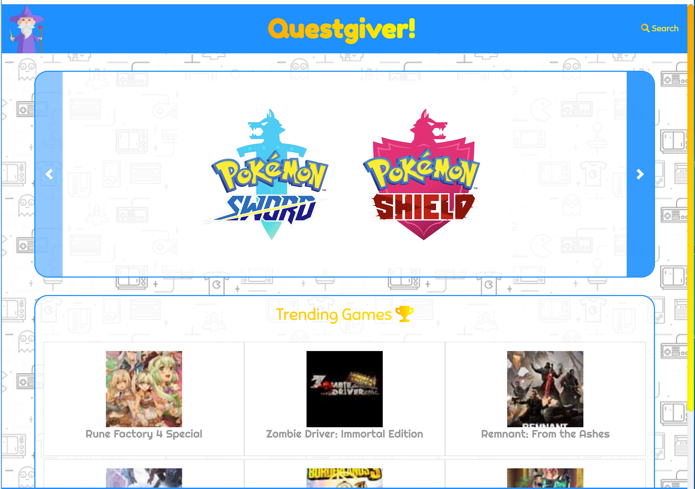

# Questgiver!

### Just finished a great game and don't know what else to play? Or perhaps you know your favorite game and want to find something else like it? Look no further, because Questgiver will do the searching for you!
Try it out!: https://rzhanghu64.github.io/projects/api-project-1/index.html
##### * View the most popular, upcoming, and trending games on our homepage.
##### * Look up any game and get information for similar games that you may also enjoy.
##### * Get a list of recommended games just based on genre and console. (Upcoming WIP feature.)
##### * Save a list of favorites and games that you plan to play.

## What Is the Goal of This Project?
#### We wish to create a web application which allows users to enter the name of a game and fetch a list of games that they may also be interested in. Planned features include saving games that users are interested in to a list, improved filtering based on genre and concepts, and a randomizer based on genre and console input.

## How Does It Work?
#### Using a combination of AJAX and Axios queries, we fetch game information from the IGDB and GiantBomb APIs. By appending elements retrieved from these queries, we generate divs which cleanly display the game information to the user.

## Screenshots

## Who Can Use this Repo?
#### Anyone! :tada:

## Credits
##### Collaborators: Henry Chen, Rachael Tseng, Marusol Lee, Richard Hu

## Notes
#### This is part of an ongoing project. Comments and feedback are much appreciated! :+1:
